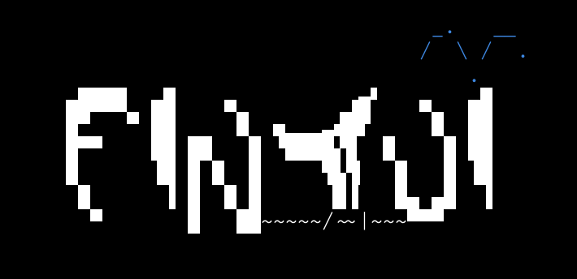

<p align="center">
    
</p>

---

# Fintui

a simple Zig TUI library

> [!WARNING]
> Fintui is nowhere near a complete stage to be used

Fintui supports only Zig 0.16.x

Setup example:
```zig
const std = @import("std");
const fintui = @import("fintui");

pub fn main() !void {
    // setup allocators
    var gpa: std.heap.DebugAllocator(.{}) = .init;
    defer std.debug.assert(gpa.deinit() == .ok);
    var arena: std.heap.ArenaAllocator = .init(std.heap.page_allocator);
    defer arena.deinit();

    // setup io implementation
    var threaded: std.Io.Threaded = .init(gpa.allocator(), .{});
    defer threaded.deinit();
    const io = threaded.io();

    // setup stdout and stdin (so much boilerplate i know)
    // buffered write is useful to prevent partially blank frames
    var stdout_buf: [1024]u8 = undefined;
    var stdout = std.Io.File.stdout().writer(io, &stdout_buf);
    const writer = &stdout.interface;

    const stdin = std.Io.File.stdin();

    // setup fintui screen!
    var screen: fintui.Screen = .init(
        gpa.allocator(),
        arena.allocator(),
        writer,
        io,
    );
    defer screen.deinit() catch {};

    // main loop
    while (true) {
        defer _ = arena.reset(.free_all); // reset frame arena per frame
        defer screen.render() catch {}; // render screen

        const delta = screen.delta(); // call this function ONCE a frame to get deltatime
        
        // render a string to the screen!
        screen.writeString(0, 0, "Some text!", .{});
    }
}
```

## Installation:

Run `zig fetch`.

```sh
zig fetch --save=fintui git+https://github.com/SolarFlurry/fintui
```

Add this to the `build.zig`:

```zig
const fintui = b.dependency("fintui", .{});
exe.root_module.addImport("fintui", fintui.module("fintui"));
```

## Features:

- Event reporting (key presses, mouse)
- Change-based rendering

For a demo examples, see the [`examples`](./src/examples/) directory.
